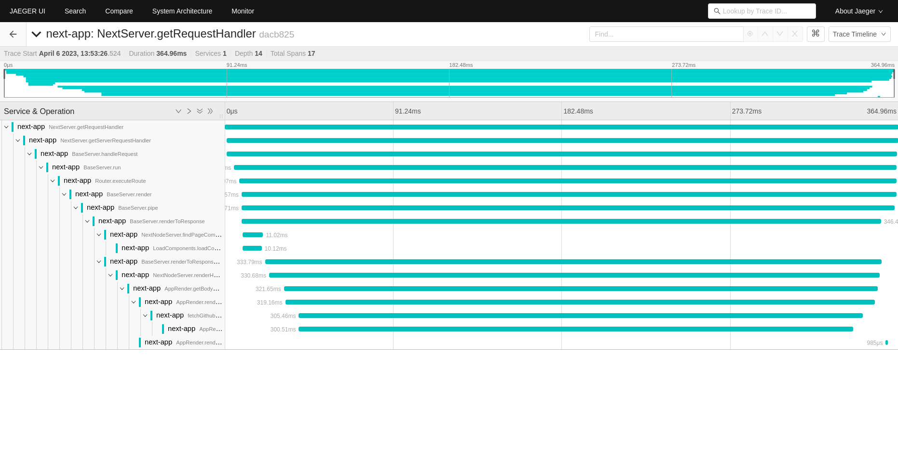

# OpenTelemetry example
Esse é um projeto de exemplo para o OpenTelemetry, onde rodamos o Next e ele exporta dados para o Jaeger.

## Requisitos
[](https://www.docker.com/)
[](https://docs.docker.com/compose/)
[](https://nodejs.org/en/)
[](https://www.npmjs.com/)

## Como rodar
1. Primeiro, precisamos instalar as dependências do projeto:
```bash
npm install
```

2. Depois, precisamos subir o docker-compose:
```bash
docker compose up
```
ou
```bash
docker-compose up
```

3. Por fim, podemos rodar o projeto:
```bash
npm run dev
```

## Como testar
1. Acesse o [localhost:16686](http://localhost:16686) para ver os dados no Jaeger.

## Resultado


## Referências
- [OpenTelemetry](https://opentelemetry.io/)
